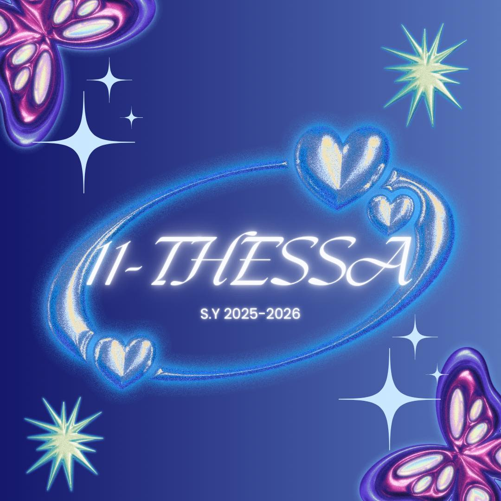

<!DOCTYPE html>
<html lang="en">
<head>
    <meta charset="UTF-8">
    <meta name="viewport" content="width=device-width, initial-scale=1.0">
    <title>11 Thessalonians Christmas Party S.Y. 2025</title>
    
</head>
<body>

    <header>
        <h1>🎄 11 Thessalonians Christmas Celebration 2025 🎄</h1>
        
“A Season of Joy, Unity, and Gratitude”

    </header>

    <main>
        <article>
            <section>
                <h2>Formal Invitation</h2>
                
The class of <strong>11 Thessalonians</strong> cordially invites you to our annual Christmas Celebration. 
                Let us come together to honor the spirit of Christmas through fellowship, joy, and thanksgiving.

            </section>

            <section class="details">
                <h3>📅 Date and Time</h3>
                
December 18, 2025 | 3:00 PM – 8:00 PM

                <h3>📍 Venue</h3>
                
5th Floor, Second Room

                <h3>👗 Attire</h3>
                
Red, Green, or White (Christmas Colors)

            </section>

            <section>
                

            <section>
                
🎁 Kindly prepare an exchange gift worth ₱150.00.

                
Let us conclude the year with gratitude, laughter, and shared happiness.

            </section>
        </article>
    </main>

    <footer>
        
Made by <strong>Aldriz Joshuel C. De Guzman</strong> | 11 Thessalonians | ICT Programming Department | Academic Year 2025

    </footer>

</body>
</html>
